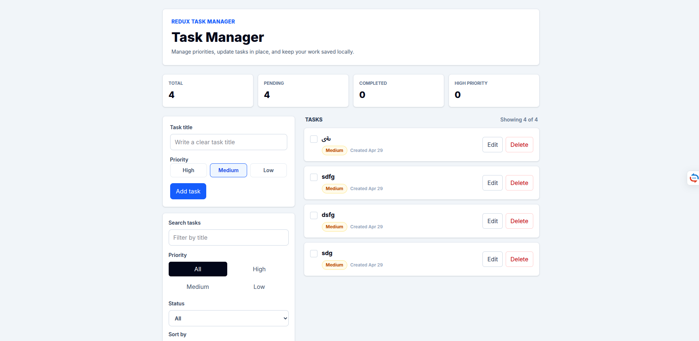
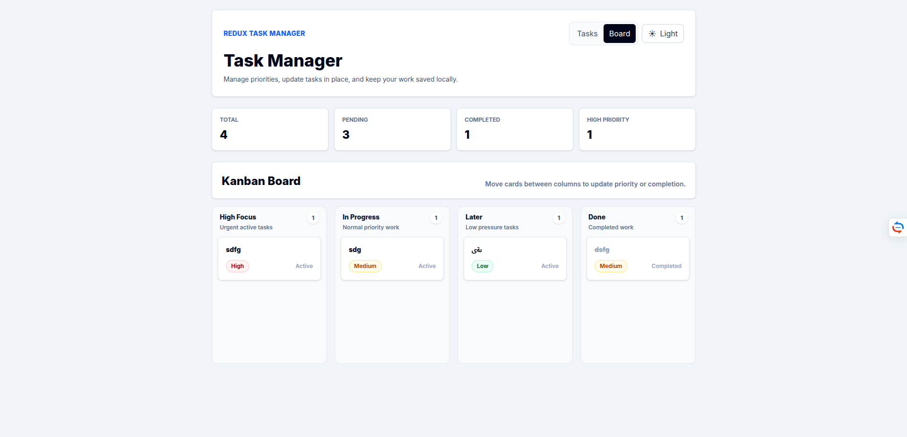
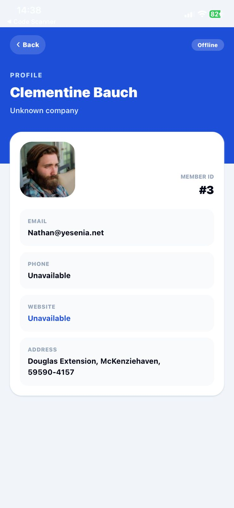
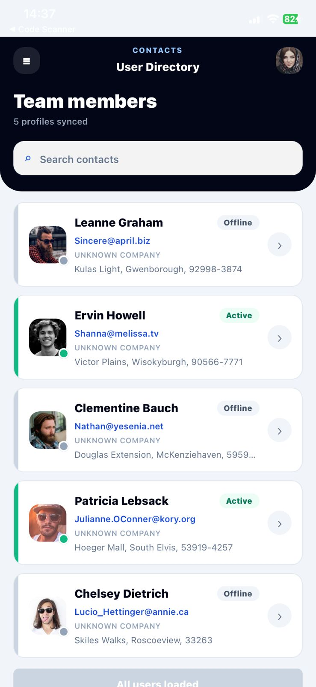

# Junior Frontend Test

Monorepo implementation for two frontend challenges:

- **React Task Manager**: web task management app with Redux, advanced filters, editing, completion state, and local persistence.
- **React Native User List**: Expo mobile app that fetches JSONPlaceholder users, stores them in Redux, supports search, pagination, and offline cache.

The workspace is set up with modern tooling around Bun, TypeScript, ESLint, Prettier, Husky, Commitlint, and GitHub Actions.

## Screenshots

### React Task Manager - Tasks



### React Task Manager - Kanban Board



### React Native User List - Directory



### React Native User List - Details



## Tech Stack

- **Runtime / package manager**: Bun
- **Web**: React, Vite, TypeScript, Redux Toolkit, React Redux, Tailwind CSS
- **Mobile**: Expo, React Native, TypeScript, Redux Toolkit, React Redux, NativeWind, AsyncStorage
- **Code quality**: ESLint flat config, Prettier, TypeScript strict checks
- **Git workflow**: Husky pre-commit hooks, lint-staged, Commitlint conventional commits
- **CI/CD**: GitHub Actions for install, lint, typecheck, build, and GitHub Pages deployment

## Repository Structure

```text
.
├─ react-task-manager/
│  ├─ src/
│  │  ├─ app/
│  │  ├─ components/
│  │  ├─ features/tasks/
│  │  ├─ hooks/
│  │  ├─ App.tsx
│  │  └─ main.tsx
│  └─ package.json
├─ react-native-user-list/
│  ├─ assets/
│  ├─ src/
│  │  ├─ app/
│  │  ├─ components/
│  │  ├─ features/users/
│  │  ├─ hooks/
│  │  ├─ screens/
│  │  ├─ services/
│  │  └─ utils/
│  └─ package.json
├─ docs/screenshots/
├─ .github/workflows/
├─ .husky/
├─ package.json
└─ bun.lock
```

## Installation

Install all workspace dependencies from the repository root:

```bash
bun install
```

For CI or reproducible installs:

```bash
bun install --frozen-lockfile
```

`--frozen-lockfile` makes Bun use the existing `bun.lock` exactly. It fails if `package.json` and the lockfile are out of sync.

## Run The Projects

### React Web App

```bash
bun run dev:web
```

Default local URL:

```text
http://localhost:5173
```

If Linux shows `ENOSPC: System limit for number of file watchers reached`, raise inotify limits:

```bash
sudo sysctl -w fs.inotify.max_user_watches=524288
sudo sysctl -w fs.inotify.max_user_instances=1024
```

### React Native App

Start Expo normally:

```bash
bun run dev:mobile
```

Start with tunnel and clear Metro cache:

```bash
bun run dev:mobile:tunnel:clear
```

Then scan the QR code with Expo Go.

For iPhone + Linux, use Expo Go over tunnel because iOS Simulator is only available on macOS.

## Quality Checks

Run all checks from the repository root:

```bash
bun run lint
bun run typecheck
bun run format:check
```

Format the code:

```bash
bun run format
```

Build the React web app:

```bash
bun run build:web
```

## Git Hooks And Commit Rules

Husky runs quality checks before commits:

- ESLint fix on staged JS/TS files
- Prettier format on staged files
- TypeScript checks

Commit messages are validated with Commitlint and should use Conventional Commits:

```text
feat: add task filters
fix: align expo sdk
chore: configure ci
```

## React Task Manager

Implemented requirements:

- Add tasks with `title`, `priority`, and `completed` state.
- Edit existing tasks.
- Delete tasks.
- Toggle completion.
- Filter by priority: `High`, `Medium`, `Low`.
- Persist tasks in `localStorage`.

Extra polish:

- Search by task title.
- Filter by status: all, active, completed.
- Sort by newest, oldest, or priority.
- Clear completed tasks.
- Dark mode stored in Redux and persisted to `localStorage`.
- Hash-based board route at `#/board`.
- Kanban board with drag and drop between priority and completed columns.
- Dashboard stats for total, pending, completed, and high-priority tasks.
- Feature-based Redux structure with selectors, types, and storage helpers.

## React Native User List

Implemented requirements:

- Fetch users from `https://jsonplaceholder.typicode.com/users`.
- Store fetched users in Redux.
- Cache users using AsyncStorage for offline support.
- Render users with optimized `FlatList`.
- Reusable `UserCard` component.
- Search users by name.
- Load more pagination.
- Transform address to `street, city, zipcode`.

Extra polish:

- Expo SDK aligned with Expo Go compatibility.
- NativeWind/Tailwind styling.
- Safe area support via `react-native-safe-area-context`.
- Directory-style profile cards with avatars and status indicators.
- User details screen with profile, contact, company, website, and address data.
- App icons, adaptive icons, favicon, and splash screen assets.
- Clean feature structure with API services, selectors, types, constants, and screen components.

## CI/CD

GitHub Actions validates the project on every push/pull request:

- Bun install with frozen lockfile
- Lint
- Typecheck
- Web build

The deployment workflow is configured for GitHub Pages using GitHub Actions.
